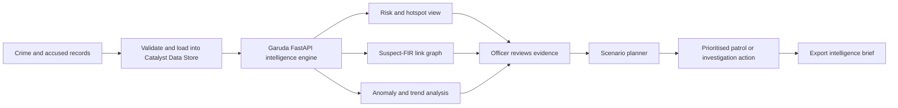
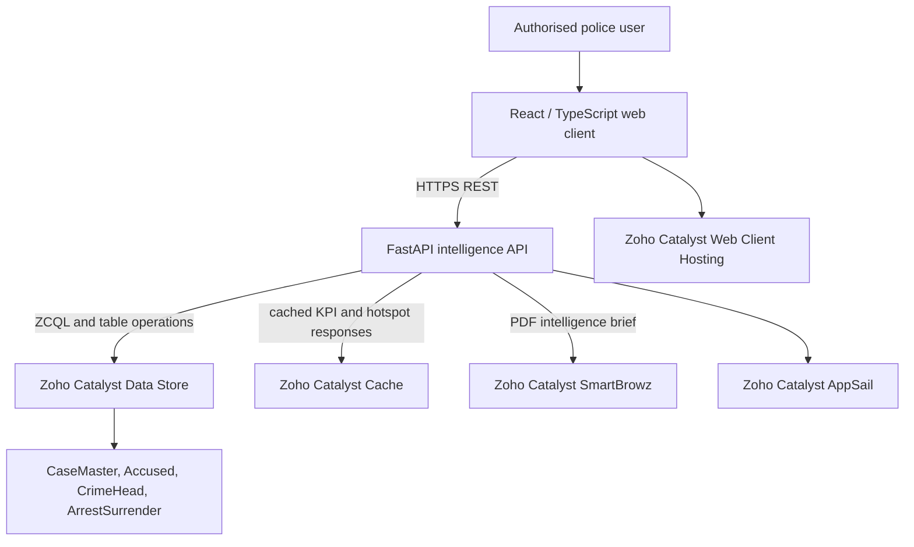

# Project Garuda - Presentation Content

Paste this content into the organizer's official presentation template. Keep the deck to 10-12 slides and lead the demo with the map, network, and scenario planner rather than dense technical detail.

## Slide 1 - Project Garuda

**From fragmented crime records to faster, explainable operational decisions**

Project Garuda is a Catalyst-native intelligence workspace for Karnataka State Police. It brings incident records, location patterns, repeat-offender links, and operational scenarios into one role-aware command view.

**Tagline:** Detect risk. Understand connections. Plan the response.

**Visual:** Full-screen product screenshot showing the hotspot map and KPI row.

## Slide 2 - Problem We Solve

Police teams often need to inspect separate tables, maps, and case records before deciding where to focus patrols. This makes it difficult to see three operational signals together:

- Where high-severity incidents are concentrated.
- Which accused and FIRs are connected across cases.
- Which intervention is most promising before resources are committed.

**Problem statement:** Convert historical, fragmented crime data into an explainable, role-aware decision workflow for prioritising patrol and investigation activity.

**Visual:** Three small inputs, `Case records`, `Geography`, and `Accused/FIR links`, converging into `Operational decision`.

## Slide 3 - Solution Brief and Opportunity

Garuda combines spatial intelligence, relationship analysis, and scenario planning in a single operational workflow.

**Why now:** Command teams need concise, defensible prioritisation rather than another static reporting dashboard.

**How Garuda solves it:**

1. Detect: map high-risk incidents and station-level statistical outliers.
2. Investigate: traverse suspect-to-FIR relationships to identify connected activity.
3. Decide: compare patrol, infrastructure, and response-time scenarios before deployment.
4. Act: capture reviewed intelligence, export a brief, and preserve access boundaries.

**USP:** Garuda links a map, a criminal-network view, and an explicit scenario model in the same Catalyst-hosted workspace. It shows the assumptions and confidence range for planning outputs instead of presenting a black-box recommendation.

## Slide 4 - What Makes It Different

| Typical approach | Project Garuda |
| --- | --- |
| Static crime report | Interactive geographic hotspot and forecast layers |
| Isolated FIR review | Suspect-FIR relationship graph for connected-case investigation |
| Reactive deployment | Adjustable, transparent intervention scenarios |
| One view for everyone | Role-based access for sensitive network and planning modules |
| Separate deployment services | Catalyst Web Client Hosting, AppSail, and Data Store in one platform |

**Responsible intelligence:** Current forecast and planner outputs are clearly labelled as trend/scenario estimates. They support human decision-making; they do not automate enforcement decisions.

## Slide 5 - Key Features

- **Geospatial risk canvas:** historical and predicted hotspot layers, density view, risk labels, and patrol-unit overlay.
- **Station anomaly alerts:** z-score based flags for stations with unusual recent incident volumes.
- **Criminal link analysis:** visual graph of accused and FIR relationships to surface repeat and connected entities.
- **Ask Garuda search:** natural-language-style filtering for crime type, area, and time window, returning matching cases.
- **Zia AutoML case-risk assessment:** structured multi-class risk classification (low/medium/high) for each case, with confidence scores and explainable feature signals.
- **What-if planner:** adjust patrol density, infrastructure health, and rapid response to compare a 30-day scenario estimate and range.
- **Secure operational workflow:** server-side badge login, signed session, and clearance-based access to sensitive modules.
- **Incident intake and brief export:** add a reviewed intelligence record and generate an intelligence brief PDF.
- **Bilingual interface:** English and Kannada UI labels for usability across teams.

**Visual:** A 3 x 3 feature grid using real product screenshots, not stock icons.

## Slide 6 - Process Flow

**Talk track:** “Garuda does not replace an officer's judgement. It shortens the path from data to a reviewed, explainable action.”

## Slide 7 - Architecture

**Design choices:** The client is a React/TypeScript single-page application. The API is Python FastAPI, which computes maps, anomalies, relationship graphs, and scenario estimates. Data Store enables managed tabular storage, while AppSail runs the backend at Catalyst-managed scale.

## Slide 8 - Technologies and Catalyst Services

**Application stack**

- Frontend: React 19, TypeScript, Vite, TanStack Router, Tailwind CSS.
- Visual intelligence: MapLibre/react-map-gl, deck.gl density layer, react-force-graph, Recharts.
- Backend and analytics: Python 3.11, FastAPI, pandas, NumPy, NetworkX.
- Security: server-side credential validation, PBKDF2 password verification, HMAC-signed sessions, role-based module access, request rate limiting.

**Zoho Catalyst services used**

| Catalyst service | Role in Garuda |
| --- | --- |
| Web Client Hosting | Hosts the static React application |
| AppSail | Hosts the Python FastAPI intelligence API |
| Data Store and ZCQL | Persists and queries crime-related tabular records |
| Cache | Caches KPI, hotspot, and anomaly responses with local-development fallback |
| SmartBrowz | Generates intelligence brief PDFs when available; a local PDF fallback keeps the prototype usable |

## Slide 9 - QuickML Risk Classification

**Structured machine learning for operational decision support**

Garuda uses a **QuickML Random Forest pipeline** to estimate case-level risk as a structured classification task, with model explanations enabled for review.

**How it works:**
1. Garuda extracts eight structured case features: offence gravity, repeat-accused frequency, accused count, arrest count, arrest rate, station case volume, crime-type prevalence, and case age.
2. These features are sent to a published QuickML multi-class prediction endpoint in real time.
3. The classifier returns a risk label (low, medium, high) and confidence scores.
4. Officers see the predicted class, confidence, and the contributing feature signals—not a black-box score.

**Model performance (held-out validation on 100,000 synthetic cases):**
- Accuracy: **94.53%**
- F1 score: **0.9181**
- Precision: **0.9181**
- Recall: **0.9181**
- AUC: **0.9385**

**Important:** This is a prototype model trained on synthetic data for demonstration. Field deployment requires validation against real, anonymised KSP historical records and approval from data governance.

**Fallback behavior:** If the QuickML endpoint is unavailable, Garuda automatically switches to a transparent local rule-based classifier so the system remains operational.

## Slide 10 - Prototype Performance and Validation

**Prototype dataset and execution evidence**

- Seeded synthetic pilot dataset: **5,000 cases**, **approximately 8,500 accused records**, **15 crime categories**, and **100 Bengaluru station IDs** across 2022-June 2026.
- The deployed Catalyst Data Store refresh returned **5,001 cases** and a relationship graph of **13,722 nodes** in the tested live environment.
- Dashboard-heavy components are lazy-loaded so the authentication and primary view remain lightweight.
- KPI, hotspot, and anomaly results use a 30-second cache to avoid repeated computation for common views.
- The health endpoint reports loaded case and graph-node counts, enabling simple deployment smoke checks.

**Important evaluation note:** This is a synthetic-data prototype. The forecasting and what-if planner are transparent statistical/scenario models, not validated crime prediction claims. A field pilot with approved historical data is the next benchmarking step.

**Visual:** Use a screenshot of the live KPI/map view plus a small “5,001 cases | 13,722 graph nodes” callout.

## Slide 11 - Impact, Roadmap, and Cost

**Expected impact**

- Faster prioritisation of locations and cases for supervisor review.
- More context for investigators handling repeat or connected accused.
- More accountable resource discussions because scenario assumptions are visible.
- A foundation for station-level data onboarding without moving teams across separate tools.

**Next development**

1. Pilot with authorised, anonymised KSP historical data and define precision/recall and response-time metrics.
2. Add live CAD/GPS integration only after data-governance approval.
3. Calibrate the scenario model by district and publish model cards, audit logs, and human-review controls.
4. Add Kannada narrative translation through an approved translation service.

**Estimated implementation cost:** Prototype hosting can begin within Catalyst's applicable free/development allowance. Production cost depends on AppSail compute, Data Store volume, SmartBrowz PDF usage, retention policy, and the approved scale of integrations. Confirm current Catalyst pricing before quoting a final INR value.

**ML model integration roadmap:**
1. Validate Zia AutoML risk predictions in production with real KSP historical data.
2. Publish model card with feature importance, decision boundaries, and confidence ranges.
3. Implement human-in-the-loop review logs so officers can provide feedback on predictions.
4. Extend to district-specific calibration and domain-expert validation.

## Slide 12 - Submission and Demo

**Live deployment:** `[PASTE CATALYST WEB CLIENT URL]`

**Public GitHub repository:** `[PASTE PUBLIC GITHUB URL]`

**Demo video:** `[PASTE PUBLIC GOOGLE DRIVE OR UNLISTED YOUTUBE URL]`

**Demo sequence - keep it under 3 minutes**

1. State the operational problem in 15 seconds.
2. Log in as an authorised officer and show role-aware modules.
3. Open the map, switch risk layers, and inspect one hotspot.
4. Move to the link graph and explain a suspect-to-FIR connection.
5. Ask Garuda a question and show plan -> execute -> answer with source transparency.
6. In Planner, run one scenario and create a response operation from the reviewed signal.
7. Open ActionLoop field workflow, acknowledge/update the operation, and show attachment + observation capture.
8. Show the closed loop: operation status, audit trail, and automated maintenance assessment path.
9. Export the intelligence brief and close on Catalyst-native deployment.

## Slide 12 Continued - Final Submission Checklist

- [ ] Use the official organizer template, not this markdown layout.
- [ ] Replace every bracketed placeholder with a public, tested URL.
- [ ] Verify the Catalyst Web Client URL in an incognito browser.
- [ ] Verify the GitHub README includes setup, run, and deployment instructions.
- [ ] Set the Drive video to “Anyone with the link” or make YouTube unlisted.
- [ ] Open all links from a device that is not logged into your accounts.
- [ ] Use current screenshots from the deployed prototype and keep labels readable.
- [ ] Confirm Zia AutoML risk model is active and `/api/risk/1` returns predictions.
- [ ] Do not claim Zia translation or generative AI in the deck; Zia AutoML risk classification is the active ML capability.