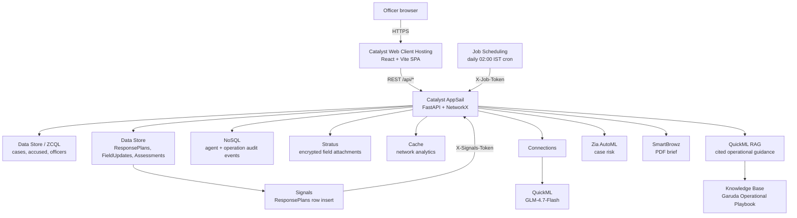

# Project Garuda

**A Catalyst-native intelligence workspace that turns 124,000 fragmented Karnataka crime
records into an explainable, role-aware workflow for prioritising patrol and investigation.**

Built for the Karnataka State Police (KSP) Datathon 2026, entirely on Zoho Catalyst.

> Every number in this README is measured, not estimated. Regeneration commands are in
> [HACKATHON_SUBMISSION.md §11](HACKATHON_SUBMISSION.md#11-how-to-regenerate-every-number-in-this-file).
> Where a claim is a limitation instead of a result, it's stated as one — see
> [§10 Responsible AI & limitations](#responsible-ai-and-limitations).

---

## Live demo

| | |
| --- | --- |
| **Frontend** | https://garuda-60078749238.development.catalystserverless.in/app/ |
| **Backend** | https://garuda-api-50044100457.development.catalystappsail.in |
| **API health** | https://garuda-api-50044100457.development.catalystappsail.in/health |

**Demo accounts** (public sandbox credentials — no Zoho account needed; authentication and RBAC are enforced server-side):

| Badge | Password | Role | Clearance | Shows |
| --- | --- | --- | --- | --- |
| `KSP-BLR-1001` | `constable123` | Constable | CLR-1 | Most modules gated (RBAC floor) |
| `KSP-BLR-4412` | `garuda2026` | Sub-Inspector | CLR-4 | Partial gating (planner unlocked) |
| `KSP-BLR-7741` | `sentinel2026` | Circle Inspector | CLR-7 | Network graph + planner + export |
| `KSP-DGP-0001` | `dgp2026` | DGP | CLR-7 | Full statewide access |

**3-minute evaluator path:** log in as `KSP-BLR-1001` (note the gated modules) → log out,
log in as `KSP-DGP-0001` (same screens unlock — RBAC is real, not cosmetic) → open the map,
toggle Historical → Predicted, click a hotspot → drill from statewide into one district →
open Network, run Kingpins, then trace a path between two suspects → ask Ask Garuda a
question in Kannada and show plan -> execute -> answer trace → open the planner, move a slider,
run a scenario, create an operation, then open ActionLoop to acknowledge/update with a field note
and attachment → show status + audit evidence, then export the PDF brief.

---

## What it does

Police teams routinely inspect separate tables, maps, and case records before deciding
where to focus patrols. Garuda collapses that into one Catalyst-hosted workspace over a
**124,000-case statewide Karnataka dataset spanning 9 districts**.

- **Geospatial risk canvas** — historical/predicted hotspot layers, hex density map, station
  anomaly z-score alerts, statewide ↔ district ↔ station drilldown.
- **Deep network analysis** — a real suspect co-offender graph with centrality-ranked
  "kingpins" (degree/betweenness/eigenvector), community detection, shortest-path
  connection tracing with hop-by-hop explanations, and labelled (non-evidentiary) link
  prediction.
- **Ask Garuda** — natural-language querying in English or Kannada, backed by an 8-action
  planner with a visible plan → execute → observe → answer reasoning trace, and a QuickML
  (GLM-4.7-Flash) LLM path with a deterministic rules-based fallback.
- **Predictive rigor** — 4 forecasting models backtested against each other with MAE/MAPE
  plus the criminology-standard PAI/PEI metrics; the simplest model is deployed because it
  measurably won, not by default.
- **What-if planner** — patrol density / infrastructure / response-time scenario modelling
  with a stated confidence range, not a bare point estimate.
- **Secure operational workflow** — server-side badge login, HMAC-signed sessions,
  clearance-gated modules, and an agent audit trail persisted to Catalyst NoSQL.
- **Incident intake, OCR-assisted FIR scan, and PDF brief export** — every figure in the
  exported brief is computed server-side from live scoped data at export time.
- **ActionLoop field workflow** — supervisors turn anomaly evidence into assigned response
  tasks; constables use a plain-language mobile view to start work, attach a photo/PDF,
  record observations, and complete the task. Structured field history, conservative
  outcome assessment, and a reviewed operation debrief close the loop.
- **Bilingual UI** (English/Kannada, including district names) and full light/dark themes.

---

## Architecture



The frontend is fully stateless (all data via REST). The backend wraps every Catalyst SDK
call in try/except with a local CSV/in-memory fallback, so it degrades gracefully instead
of hard-failing when a service is unavailable — this is deliberate, not defensive filler,
and is exercised by the test suite.

### Zoho Catalyst services in use

| Service | How Garuda uses it |
| --- | --- |
| **Web Client Hosting** | Serves the built React SPA under `/app/`, with a custom `404.html` deep-link shim |
| **AppSail** | Hosts the FastAPI backend (Python 3.11, vendored Linux wheels) |
| **Data Store / ZCQL** | Case data plus durable `ResponsePlans`, `FieldUpdates`, and assessment snapshots |
| **NoSQL** | Append-only audit trails for agent actions and operation lifecycle events |
| **Cache** | Persists the network-analytics blob across restarts (6-hour TTL) |
| **Connections** | Auto-refreshed OAuth for QuickML, replacing a manual 1-hour token |
| **QuickML (LLM Serving)** | GLM-4.7-Flash powers the Ask Garuda natural-language planner |
| **QuickML RAG / Knowledge Base** | Retrieves source-tagged bilingual operational safeguards for Ask Garuda; every answer is labeled prototype guidance and cites the playbook |
| **Zia AutoML** | Structured case-risk classification |
| **Zia OCR** | Scanned/photographed FIR → draft incident form (never auto-submits) |
| **SmartBrowz** | PDF intelligence-brief generation |
| **Stratus** | Encrypted, versioned `garuda-operations` evidence bucket plus import staging |
| **Job Scheduling** | Daily cron re-runs the ActionLoop outcome assessment over completed operations |
| **Signals** | `ResponsePlans` row inserts are pushed to the backend as operation lifecycle events |

Catalyst API Gateway cannot front an AppSail app directly (only Basic/Advanced I/O
Functions and Web Client are valid targets) — CORS origin restriction (`ALLOWED_ORIGINS`)
and in-app rate limiting are used instead; see `backend/main.py`.

### Automation layer (live resource IDs)

The ActionLoop does not depend on someone keeping a browser tab open — two Catalyst
automations drive it:

| Resource | Name | ID | Behaviour |
| --- | --- | --- | --- |
| Job Pool | `GarudaAnalytics` | `52319000000163006` | AppSail-type pool, capacity 1 |
| Cron | `GarudaOpsMaintenance` | `52319000000163009` | Daily 02:00 Asia/Kolkata → `POST /api/internal/operations/maintenance` (3 retries, 60 s apart) |
| Signals publisher | Garuda Data Store | `12279000000021058` | CloudScale Data Store event source |
| Signals rule | `GarudaOperationEvents` | `12279000000021067` | Row Insert on `ResponsePlans` (`52319000000154015`) |
| Signals target | `Garuda Operations` | `12279000000021066` | `instant_batch` dispatch, 24 h TTL, 5 retries |
| Signals webhook | `Garuda Operations Receiver` | `12279000000021065` | `POST /api/internal/operations/signals` |

Both internal endpoints are shared-secret gated (`X-Job-Token` / `X-Signals-Token`
validated with `hmac.compare_digest` against AppSail env vars `JOB_SCHEDULER_TOKEN` and
`SIGNALS_WEBHOOK_TOKEN`). Verified live: the maintenance endpoint returns `200` with the
cron's configured token, the signals receiver returns `200` with the correct token and
`403` with a wrong one, and creating operations through the live API produced Row Insert
events that Signals logged as **Success** against the webhook.

Three Catalyst-side gotchas worth recording, since none of them surface an error in the
console UI: cron names are capped at **20 characters** (the validation message is never
rendered); Catalyst's 17-digit resource IDs exceed `Number.MAX_SAFE_INTEGER`, so any
tooling that parses them as JSON numbers will silently corrupt them; and a webhook saved
without headers fails delivery silently while the event log sits on "In Progress".

---

## Measured results

**Dataset scale**

| Table | Rows |
| --- | --- |
| CaseMaster | 124,000 |
| Accused | 217,167 |
| ArrestSurrender | 152,139 |

**Load test** (`backend/load_test.py`, single AppSail-class instance, all endpoints):

| Concurrent users | Throughput | p50 | p95 | p99 | Error rate |
| --- | --- | --- | --- | --- | --- |
| 10 | 34.3 req/s | 129 ms | 886 ms | 913 ms | 0.0% |
| 50 | 34.2 req/s | 1,381 ms | 1,995 ms | 2,156 ms | 0.0% |
| 100 | 34.5 req/s | 2,934 ms | 3,276 ms | 3,352 ms | 0.0% |

Cold start 6.84s; server memory 232-274 MB RSS. This proves prototype-level concurrency
handling, not certified production capacity — see [PRODUCTION_ROADMAP.md](PRODUCTION_ROADMAP.md).

**Agent evaluation** (`backend/agent_eval.py`, 64 labelled EN/KN queries, 8 actions):
100% tool-selection accuracy, 100% parameter accuracy, 0% fallback rate on the rules
planner. Documented honestly as a regression check against the planner it was authored
alongside, not a blind third-party benchmark.

**Forecast backtest** (`/api/hotspots/forecast/backtest`, rolling-origin, 6 months, 164 stations):
`linear_trend` deployed because it won on MAE (2.99) and MAPE (29.4%) against `ewma`,
`seasonal_naive`, and `naive` baselines — an upgrade to gradient boosting was deliberately
not made because the simple model already beat every baseline.

**Performance fixes in this build**

| Fix | Before | After |
| --- | --- | --- |
| `/api/reports` per-request cost | 85.92 ms | 3.77 ms (~23×) |
| Time until app is request-ready | ~14.3 s | ~3.7 s (heavy analytics moved off the boot path) |

**Quality gates**

| Check | Result |
| --- | --- |
| `npx tsc --noEmit` | 0 errors |
| `npx vitest run` | 73/73 passing, including Connections canvas interaction-handler coverage |
| `pytest test_agent.py test_operations.py test_risk_prediction.py` | 75/76 in the latest combined Windows run; the sole timing-threshold test passed when rerun alone |
| `npm run build` | Succeeds |

Full methodology and regeneration commands: [HACKATHON_SUBMISSION.md](HACKATHON_SUBMISSION.md).

---

## Responsible AI and limitations

Stated plainly, because the code already labels them and judges reading the source will
find them regardless:

- **No demographic attributes** (age, gender, caste, religion) are model inputs anywhere in
  the pipeline — verified in `backend/bias_audit.py`.
- **Cross-district bias audit** ships as a runnable script flagging any district that
  deviates from the statewide risk-flag rate; it surfaces deviations, it does not explain them.
- **All data is synthetic.** No real KSP case records were used anywhere in this system.
- **`district_indicators.py`** ships synthetic placeholder socio-economic indicators, not
  real Census/NCRB statistics — labelled `synthetic_placeholder` in its own output.
- **`cctns_adapter.py`** is an illustrative CCTNS/ICJS field mapping built from public FIR
  concepts, not verified against the authoritative NCRB data dictionary.
- **Forecast and planner outputs are labelled estimates with confidence ranges** — they
  support human decisions, they do not automate enforcement, and the feedback-loop risk
  (predictions shift patrols shift future recorded crime) is documented, not hidden.
- **The investigation-time-reduction study** (`INVESTIGATION_TIME_STUDY.md`) is a real,
  instrumented protocol; the human-baseline timing side requires 3+ real participants and
  is not fabricated to look complete.
- Full detail in [MODEL_CARD.md](MODEL_CARD.md), [THREAT_MODEL.md](THREAT_MODEL.md), and
  [PRODUCTION_ROADMAP.md](PRODUCTION_ROADMAP.md).

---

## Local development

```powershell
# Backend
cd backend
python -m venv .venv-test
.\.venv-test\Scripts\pip install -r requirements.txt
.\.venv-test\Scripts\python.exe main.py        # http://localhost:8000

# Frontend (separate terminal, from repo root)
$env:VITE_API_URL="http://localhost:8000"; npm install; npm run dev
```

`backend/vendor/` (vendored Linux wheels for AppSail) is not needed for local dev — the
zcatalyst-sdk import is wrapped in try/except and simply falls back to local CSV/in-memory
mode, which is what you want for local testing anyway.

### Deploying to Zoho Catalyst

```powershell
npm run build
catalyst deploy --only client                  # safe frontend-only deploy

# Backend release preparation (do not deploy until the secret-preservation
# requirement below is satisfied)
cd backend
python -m pip install -r requirements.txt --target vendor `
  --platform manylinux2014_x86_64 --python-version 3.11 `
  --implementation cp --abi cp311 --only-binary=:all:
cd ..
```

Key gotchas (full detail in [DEPLOY.md](DEPLOY.md)):
1. AppSail runs the start command with **no shell** — wrap env-var expansion in
   `sh -c '...'` or `$X_ZOHO_CATALYST_LISTEN_PORT` is passed as a literal string.
2. AppSail does **not** install `requirements.txt` on the server — vendor Linux wheels
   locally first (command above).
3. `zcatalyst_sdk.initialize(req=request)` must run fresh **inside every request
   handler**, never once at startup.
4. `catalyst deploy --only appsail` **replaces** live AppSail env vars with exactly what's
  in `app-config.json`. Do not run it until every Console-only secret, including
  `SESSION_SECRET`, `SEED_TOKEN`, `JOB_SCHEDULER_TOKEN`, and
  `SIGNALS_WEBHOOK_TOKEN`, is preserved through an untracked release configuration.
  Never commit those values. Re-check the complete environment in Console → AppSail →
  Configuration immediately after deployment and verify `/health` before proceeding.

---

## Repository map

| Path | What it is |
| --- | --- |
| `backend/main.py` | FastAPI app — every endpoint, scoping, agent logic, security hardening |
| `backend/generate_statewide_data.py`, `scale_data.py` | Synthetic data generation |
| `backend/*_audit.py`, `investigation_time_study.py`, `load_test.py`, `agent_eval.py` | Runnable measurement scripts backing every number in this README |
| `src/` | React/Vite/TanStack Router frontend |
| `AGENTS.md` | Custom agent routing used to build this repo (frontend/backend/DevOps split) |
| [HACKATHON_SUBMISSION.md](HACKATHON_SUBMISSION.md) | Full submission copy — canonical source for every measured claim |
| [MODEL_CARD.md](MODEL_CARD.md) | Risk model, forecast, network analytics, agent, bias-audit documentation |
| [THREAT_MODEL.md](THREAT_MODEL.md) | Assets, trust boundaries, fixed and open security findings |
| [PRODUCTION_ROADMAP.md](PRODUCTION_ROADMAP.md) | Load test results, cost scaling shape, decade roadmap |
| [INVESTIGATION_TIME_STUDY.md](INVESTIGATION_TIME_STUDY.md) | Protocol + instrumentation for the impact study |
| [DEPLOY.md](DEPLOY.md) | Full Catalyst deployment walkthrough |

`DEPLOY.md`, `QUICK_DEPLOYMENT.md`, `QUICKML_INTEGRATION.md`, `FRONTEND_INTEGRATION_GUIDE.md`,
`RISK_ASSESSMENT_VISUAL_GUIDE.md`, and `PRESENTATION_CONTENT.md` are supplementary/how-to
docs, current as of the latest deploy; start from this README and HACKATHON_SUBMISSION.md
for evaluator-facing claims.

---

## Tech stack

**Frontend:** React + TanStack Router + Vite + TypeScript + Tailwind CSS v4 + shadcn/ui +
MapLibre GL (`react-map-gl`) + deck.gl + `react-force-graph-2d`

**Backend:** Python 3.11 + FastAPI + Uvicorn + Pydantic + NetworkX + pandas + NumPy + fpdf2 + zcatalyst-sdk

**Testing:** Vitest + Testing Library (frontend, 73 tests), pytest (backend, 76 collected tests)

**Infrastructure:** Zoho Catalyst — AppSail, Web Client Hosting, Data Store, NoSQL, Cache,
Connections, QuickML LLM Serving and RAG/Knowledge Base, Zia AutoML/OCR, SmartBrowz,
Stratus, Job Scheduling, and Signals