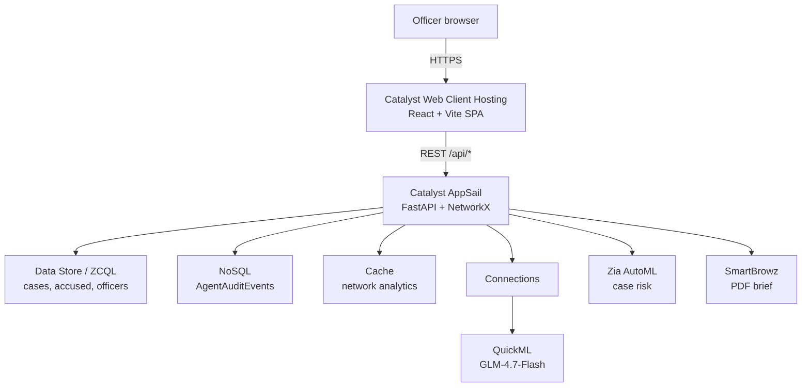

# Project Garuda — Hackathon Submission Copy

Copy-paste source for the official application form. Each section maps to a field
most hackathon/datathon forms ask for. Numbers here are **measured**, not estimated —
regenerate them with the commands in [§11](#11-how-to-regenerate-every-number-in-this-file)
if the code changes.

---

## 1. Identity fields

| Field | Value |
| --- | --- |
| **Project name** | Project Garuda |
| **Category** | Public safety / law-enforcement intelligence |
| **Event** | Karnataka State Police (KSP) Datathon 2026 |
| **Tagline** | Detect risk. Understand connections. Plan the response. |
| **Platform** | Zoho Catalyst (Web Client Hosting + AppSail + Data Store) |

---

## 2. One-liner (≈25 words)

> A Catalyst-native intelligence workspace that turns 124,000 fragmented Karnataka crime
> records into an explainable, role-aware workflow for prioritising patrol and investigation.

## 3. Short abstract (≈50 words)

> Project Garuda unifies incident geography, repeat-offender networks, and scenario planning
> into one command view for Karnataka State Police. It surfaces where high-severity crime
> concentrates, which accused and FIRs connect across cases, and what a proposed intervention
> would plausibly change — with assumptions and confidence ranges shown, never a black-box verdict.

## 4. Long description (≈150 words)

> Police teams routinely inspect separate tables, maps, and case records before deciding where
> to focus patrols. Garuda collapses that into a single Catalyst-hosted workspace built on a
> 124,000-case Karnataka dataset spanning nine synthetic districts.
>
> Four capabilities work together. A geospatial risk canvas shows historical and predicted
> hotspot layers with QuickML station forecasts and anomaly flags. A criminal link-analysis graph
> traverses accused-to-FIR relationships to surface connected activity, ranked offenders, and
> detected communities. Ask Garuda answers natural-language questions in English or Kannada.
> A what-if planner compares patrol, infrastructure, and response-time scenarios before
> resources are committed.
>
> Every module is role-gated by officer clearance, backed by server-side badge authentication
> and signed sessions. Forecast and planner outputs are explicitly labelled as estimates that
> support human decisions rather than automate enforcement — a stance backed by a shipped model
> card, threat model, and cross-district bias audit.

---

## 5. Key features

- **Geospatial risk canvas** — historical and predicted hotspot layers, hex density view, risk
  labels, patrol-unit overlay, statewide↔district drilldown.
- **Station anomaly alerts** — QuickML Embedded XGBoost classification with current-count,
  trailing-mean, and z-score evidence; local z-score detection remains the fallback.
- **Patrol allocation recommendations** — combines QuickML forecast and anomaly signals into a
  human-reviewed recommendation bounded by the available demo fleet.
- **Senior Command views** — DGP statewide comparison and ACP district-locked comparison with
  7/30/90-day changes, drilldowns, decision queue, and recommended allocations.
- **Catalyst-native voice** — English/Kannada QuickML transcription, synthesis, and translation.
- **Criminal link analysis** — suspect/FIR relationship graph with centrality-ranked "kingpins",
  community detection, shortest path between two entities, and link prediction.
- **Ask Garuda** — English/Kannada natural-language planning across 14 operational tools plus
  an explicit out-of-scope response, with a visible execution trace.
- **Case-risk assessment** — multi-class low/medium/high classification per case with confidence
  scores and explainable feature signals.
- **What-if planner** — adjustable patrol density, infrastructure health, and rapid-response
  levers producing a 30-day scenario estimate *with a stated range*.
- **Secure operational workflow** — server-side badge login, HMAC-signed sessions, clearance-based
  module access, and an agent audit trail persisted to Catalyst NoSQL.
- **Incident intake & brief export** — record reviewed intelligence and generate a PDF brief.
- **Bilingual UI** — full English/Kannada interface including district names.
- **Consistent dark interface** — one operational visual theme across desktop and mobile.

---

## 6. Tech stack

| Layer | Technology |
| --- | --- |
| Frontend | React, Vite, TypeScript, TanStack Router, Tailwind CSS v4, shadcn/ui |
| Mapping | MapLibre GL via `react-map-gl`, deck.gl hex density layer |
| Graph | `react-force-graph-2d` |
| Backend | Python 3.11, FastAPI, Uvicorn, Pydantic |
| Analytics | NetworkX (centrality, community detection), pandas, NumPy |
| Reporting | fpdf2 |
| Testing | Vitest + Testing Library (frontend), pytest (backend) |

---

## 7. Zoho Catalyst services used

| Service | How Garuda uses it |
| --- | --- |
| **Web Client Hosting** | Serves the built React SPA under `/app/`, with a custom `404.html` deep-link shim |
| **AppSail** | Hosts the FastAPI backend (Python 3.11 stack, vendored Linux wheels) |
| **Data Store / ZCQL** | Officer credential lookup and bulk case data, paginated via ZCQL |
| **NoSQL** | `AgentAuditEvents` table — append-only audit trail of every agent action |
| **Cache** | Persists the network-analytics blob across restarts (6-hour TTL) |
| **Connections** | Auto-refreshed OAuth for QuickML, replacing a manual 1-hour token |
| **QuickML (LLM Serving)** | GLM-4.7-Flash powers the Ask Garuda natural-language planner |
| **Zia AutoML** | Structured case-risk classification |
| **SmartBrowz** | PDF intelligence-brief generation |
| **Stratus** | Staging bucket for CLI-based Data Store imports |

Every Catalyst call is wrapped with a local fallback, so the app degrades gracefully rather
than failing when a service is unavailable.

---

## 8. Architecture



---

## 9. Measured results

**Dataset scale**

| Table | Rows |
| --- | --- |
| CaseMaster | 124,000 |
| Accused | 217,167 |
| ArrestSurrender | 152,139 |

**Load test** — `backend/load_test.py`, all endpoints, single AppSail-class instance:

| Concurrent users | Requests | Throughput | p50 | p95 | p99 | Error rate |
| --- | --- | --- | --- | --- | --- | --- |
| 10 | 350 | 34.3 req/s | 129 ms | 886 ms | 913 ms | **0.0%** |
| 50 | 1,750 | 34.2 req/s | 1,381 ms | 1,995 ms | 2,156 ms | **0.0%** |
| 100 | 3,500 | 34.5 req/s | 2,934 ms | 3,276 ms | 3,352 ms | **0.0%** |

Cold start 6.84 s; server memory stayed between 232–274 MB RSS throughout.

**Agent evaluation** — `backend/agent_eval.py`, 64 labelled queries across 8 actions:
100% tool-selection accuracy, 100% parameter accuracy (17 samples checked), 0% fallback rate.

**Performance work in this build**

| Improvement | Before | After |
| --- | --- | --- |
| Reports endpoint | 85.92 ms | **3.77 ms** (~23×) |
| Time to request-ready | ~14.3 s | **~3.7 s** |

**Quality gates**

| Check | Result |
| --- | --- |
| `npx tsc --noEmit` | 0 errors |
| `npx vitest run --reporter=dot` | 79/79 passing across 9 files |
| Affected backend integration suites | 25/25 passing (Command, voice, forecast, anomaly, FIR, and role reporting) |
| `npm run build` | Succeeds |

---

## 10. Responsible AI, limitations, and honesty notes

State these plainly — judges reading the source will find them, and the code already
labels them.

- **No demographic attributes** (age, gender, caste, religion) are model inputs anywhere in
  the pipeline. Verified in `bias_audit.py` and documented in [MODEL_CARD.md](MODEL_CARD.md).
- **Cross-district bias audit** ships as a runnable script that flags any district deviating
  from the statewide average flag rate for human review. It surfaces deviations; it does not
  explain them.
- **The data is synthetic.** No real KSP case records were used.
- **`district_indicators.py` is synthetic placeholder data**, not real Census/NCRB statistics.
  Swapping in cited public indicators is a drop-in change.
- **`cctns_adapter.py` is an illustrative mapping**, built from publicly known FIR concepts —
  not a verified CCTNS/ICJS schema. It must be reviewed against the authoritative NCRB data
  dictionary before any real integration.
- **The agent evaluation is a regression check, not a blind benchmark** — the query set was
  authored alongside the rules planner. The QuickML LLM path is the more meaningful signal
  and was not configured for the recorded run.
- **Forecast and planner outputs are labelled estimates** with confidence ranges. They support
  human decisions; they do not automate enforcement.
- Full analysis in [THREAT_MODEL.md](THREAT_MODEL.md), [MODEL_CARD.md](MODEL_CARD.md), and
  [PRODUCTION_ROADMAP.md](PRODUCTION_ROADMAP.md).

---

## 11. How to regenerate every number in this file

```powershell
# Quality gates
npx tsc --noEmit
npx vitest run
npm run build
cd backend; .\.venv-test\Scripts\python.exe -m pytest -q test_agent.py test_risk_prediction.py; cd ..

# Measured reports (written to backend/data/*.json)
cd backend
python load_test.py                 # -> data/load_test_report.json
python agent_eval.py                # -> data/agent_eval_report.json
python bias_audit.py                # -> data/bias_audit_report.json
python investigation_time_study.py --base-url http://localhost:8000
cd ..

# Dataset row counts
foreach ($f in @("CaseMaster","Accused","ArrestSurrender")) {
  "{0}: {1}" -f $f, ((Get-Content "backend/data/$f.csv" -ReadCount 0).Count - 1)
}
```

> Run `pytest` **scoped to the two test files** as shown. A bare `pytest` collects
> `backend/vendor/` and fails on the vendored numpy/pandas test suites.

---

## 12. Demo access

**Live URLs**

- Frontend — `https://garuda-60078749238.development.catalystserverless.in/app/`
- Backend — `https://garuda-api-50044100457.development.catalystappsail.in`

**Demo accounts** — each shows a different clearance level, so use more than one to
demonstrate role-based access control:

| Badge | Password | Role | Clearance | Shows |
| --- | --- | --- | --- | --- |
| `KSP-DGP-0001` | `dgp2026` | DGP | CLR-7 | Full statewide access |
| `KSP-ACP-0001` | `acp2026` | ACP | CLR-6 | Bengaluru district command |
| `KSP-BLR-4412` | `garuda2026` | Sub-Inspector | CLR-4 | Station reports, FIR intake, workflow, and planning |
| `KSP-BLR-1001` | `constable123` | Constable | CLR-1 | Station read-only reports and mobile Field Mode |

These are deliberately fixed demo credentials so evaluators never need their own Zoho
account. They are public sandbox credentials exposed by the login quick-fill controls;
authentication and role permissions are still enforced server-side.

**Local run**

```powershell
# Backend
cd backend; python -m venv .venv-test
.\.venv-test\Scripts\pip install fastapi uvicorn pydantic networkx pandas fpdf2
.\.venv-test\Scripts\python.exe main.py     # http://localhost:8000

# Frontend (separate terminal)
$env:VITE_API_URL="http://localhost:8000"; npm run dev
```

---

## 13. Suggested 3-minute demo script

1. **Log in as `KSP-BLR-1001`** (Constable) — show station-only redacted reports and Field Mode.
2. **Log in as `KSP-BLR-4412`** (SI) — show station FIR intake and workflow controls.
3. **Log in as `KSP-ACP-0001`** — show the server-locked Bengaluru district Command view.
4. **Log in as `KSP-DGP-0001`** — show statewide Command and all modules. RBAC is server-enforced.
3. **Map** — toggle historical → predicted, open a hotspot popup showing jurisdiction,
   nearest patrol, and the causal narrative.
4. **Drill from statewide into one district** — every panel re-scopes together.
5. **Network** — run kingpins, then trace a path between two connected accused.
6. **Ask Garuda** — ask a question in Kannada and show plan -> execute -> answer trace.
7. **Planner** — move a slider, hit Run Test, point at the *confidence range*, then create an operation.
8. **ActionLoop** — acknowledge/update the operation with a field note and attachment, then show status plus audit evidence.
9. **Export the PDF brief** to close.
